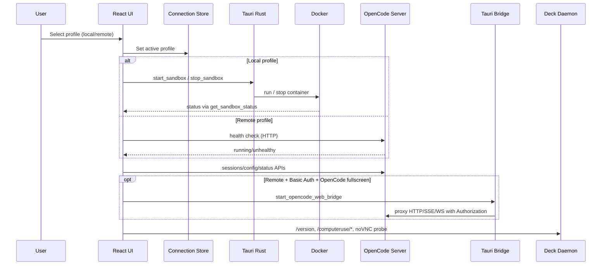

# Guide: apps/client — Deck Desktop Cockpit

`apps/client` is the Tauri v2 desktop cockpit for Deck. It now supports **dual connection modes**:

- **Local sandbox mode**: manage Docker lifecycle through Rust commands (`start_sandbox`, `stop_sandbox`, `get_sandbox_status`).
- **Remote sandbox mode**: connect directly to existing OpenCode/daemon/noVNC services without running local Docker commands.

## Architecture

```
apps/client/
├── src/                    # Frontend (React v19 + Vite v7)
│   ├── components/
│   │   ├── chat/           # AI chat interface (messages, input, tools, retry)
│   │   ├── config/         # Settings, providers, connection profiles
│   │   ├── layout/         # App shell (top bar, split panes)
│   │   ├── project/        # Project picker dialog
│   │   ├── sandbox/        # Desktop/noVNC lifecycle and boot states
│   │   ├── status/         # MCP/LSP/Formatter status bar
│   │   ├── ui/             # shadcn/ui primitives
│   │   └── viewer/         # Content/opencode/terminal/log panels
│   ├── hooks/              # Query/mutation hooks, connection-aware clients
│   ├── stores/             # Zustand stores
│   ├── lib/                # URL resolving, SDK clients, daemon helpers
│   └── routes/             # TanStack Router routes
│
└── src-tauri/              # Backend (Rust)
    └── src/
        ├── lib.rs          # Tauri command registration
        ├── sandbox/        # Docker sandbox management for local mode
        ├── opencode_bridge/ # Remote OpenCode web auth bridge (local reverse proxy)
        └── pilot_runtime/  # Pilot host/server/bridge orchestration runtime
```

## Connection Model

### Profiles

Connection profiles are stored in `stores/connection-store.ts`:

- `local` profile (built-in, immutable)
- one or more `remote` profiles (user-managed)

Each profile persists:

- `id`, `name`, `type`
- `opencodeBaseUrl`
- optional overrides: `daemonBaseUrl`, `noVncUrl`, `webTerminalUrl`
- timestamps (`createdAt`, `updatedAt`)

### Secrets

Credentials are **session-only memory state** (not persisted to disk):

- OpenCode basic auth: `opencodeUsername`, `opencodePassword`
- Daemon token: `daemonToken` (`X-Deck-Token` header)

## Endpoint Resolution

`lib/connection-endpoints.ts` resolves runtime endpoints from the active profile.

Remote defaults are inferred from OpenCode URL host/protocol when overrides are empty:

- daemon: `:2280`
- noVNC: `:6080/vnc.html?autoconnect=true&resize=scale`
- web terminal: `:22222`

Input validation is handled by Zod in `lib/connection-validation.ts` (`http/https` only).

## Core Data Flow



## UI Behavior by Mode

### Local mode

- Top bar action: **Start/Stop Sandbox**
- Desktop boot: daemon probe -> auto `computeruse/start` when inactive -> noVNC probe
- Terminal panel: enabled

### Remote mode

- Top bar action: **Connect/Disconnect Remote**
- Desktop boot: daemon probe -> check `computeruse/status`
  - inactive: show **manual** “Start Desktop Services” action
  - active: probe noVNC and render iframe
- OpenCode fullscreen:
  - without remote Basic Auth: direct iframe to remote OpenCode URL
  - with remote Basic Auth: iframe goes through local Tauri bridge URL
- Terminal panel: **disabled in this release** (explicit notice in UI)

## Query Isolation

All key query groups include a connection scope (`profileId + opencodeBaseUrl`) to avoid cache bleed across profiles:

- sessions
- config/providers/agents
- project paths/find/list
- server status (MCP/LSP/Formatter)
- commands
- sandbox status

On profile switch, the app resets session/project/viewer/sandbox UI state and invalidates related query groups.

## State Architecture

| Store | File | Responsibility |
| :--- | :--- | :--- |
| Connection | `stores/connection-store.ts` | Profile list, active profile, session-only secrets |
| Sandbox | `stores/sandbox-store.ts` | Lifecycle state (`idle/checking/connecting/...`) |
| Chat | `stores/chat-store.ts` | Active session, brain status, pending prompts/questions |
| Project | `stores/project-store.ts` | Current project directory and dialog state |
| Viewer | `stores/viewer-store.ts` | Right-panel mode and content payload |
| Config UI | `stores/config-store.ts` | Settings sheet visibility |
| Debug | `stores/debug-store.ts` | API/SSE debug logs |

## Security Notes

- Tauri HTTP capability allowlist permits remote `http://*` and `https://*`.
- Sensitive credentials are never persisted by the client.
- Daemon auth uses `X-Deck-Token` when configured.
- OpenCode web bridge binds to localhost only and keeps credentials in memory.
- Bridge lifecycle is scoped to active profile and resets on disconnect/profile switch.

## Development

```bash
cd apps/client
pnpm tauri dev
```

```bash
pnpm --filter @cofy-x/deck-app build
```

## Related Notes

- `docs/design/client-chat-retry.md` — chat retry and attachment compatibility
- `docs/design/client-remote-opencode-web-auth.md` — remote OpenCode iframe auth bridge
- `docs/design/daemon.md` — daemon architecture and auth model
- `docs/opencode/overview.md` — OpenCode server API and auth
