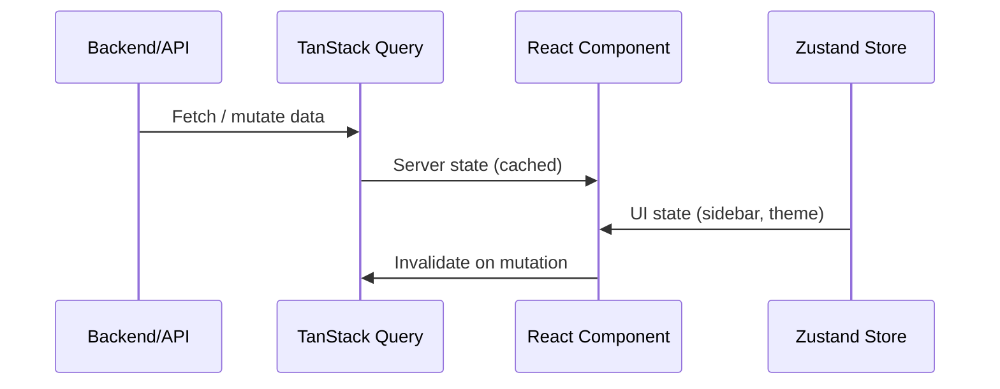

# Frontend Development Guide

Shared conventions for all React/TypeScript frontend applications in the deck monorepo.

**Applies to:** `apps/client`, `apps/dashboard`

## Tech Stack

| Category | Technology | Version | Purpose |
| :--- | :--- | :--- | :--- |
| Framework | React | v19 | Function components only |
| Build Tool | Vite | v7 | Dev server and bundler |
| Language | TypeScript | v5 | Strict mode enabled |
| Routing | TanStack Router | v1 | Type-safe, file-based routing |
| State (Server) | TanStack Query | v5 | Server state, caching, data fetching |
| State (Client) | Zustand | v5 | Persistent UI state (sidebar, theme, dialogs) |
| Styling | Tailwind CSS | v4 | Utility-first styling |
| UI Library | shadcn/ui | Latest | Headless UI + Tailwind (copy-paste) |
| Icons | Lucide React | Latest | Standard icon set |
| Forms | React Hook Form | v7 | Form state management |
| Validation | Zod | v4 | Schema validation (forms + API) |

## Component Architecture

### Structure

```
src/
├── components/
│   ├── ui/             # shadcn/ui primitives (Button, Dialog, etc.)
│   └── <feature>/      # Feature-specific components
├── hooks/              # Custom React hooks
├── routes/             # TanStack Router file-based routes
├── stores/             # Zustand stores
├── lib/                # Utilities (cn(), constants, API clients)
└── styles/             # CSS files (if any)
```

### Rules

- **Functional only** — No class components.
- **shadcn/ui first** — Never write basic UI (Button, Input, Dialog) from scratch. Use:
  ```sh
  pnpm dlx shadcn@latest add [component-name]
  ```
- **Customization** — Modify generated shadcn source in `components/ui/` directly. Do not override via external CSS.

## Styling Standards

- Use **Tailwind CSS v4** utility classes exclusively.
- Use CSS variables from `index.css` (`@theme`) for consistent branding.
- Use the `cn()` utility for conditional class merging:
  ```ts
  import { cn } from '@/lib/utils';
  cn('base-class', condition && 'conditional-class');
  ```

## State Management



- **Server state** → **TanStack Query** — For any data from backend/API.
- **Client UI state** → **Zustand** — For ephemeral UI state (sidebar toggle, user preferences, search input).
- Never use `useEffect` for data fetching. Use TanStack Query hooks.

## Type Safety

- **Routes** — All navigation must use `Link` or `useNavigate` from TanStack Router.
- **Forms** — Use React Hook Form with Zod resolver.
- **API clients** — Use generated hooks (Orval for dashboard, SDK for client).

## Content Rendering (Markdown)

- **Stack:** `react-markdown` + `remark-gfm` + `shiki`
- **Styling:** Use `@tailwindcss/typography` (`prose` class) for document flow.
- **Code highlighting:** Use `shiki` with VS Code themes (e.g., `github-dark`).

## App-Specific Differences

| Feature | `apps/client` | `apps/dashboard` |
| :--- | :--- | :--- |
| Shell | Tauri v2 (Desktop) | Browser SPA |
| Backend | Rust + Daemon SDK | NestJS API (Axios/Orval) |
| HTTP Client | Tauri HTTP plugin | Axios |
| API Gen | — | Orval (OpenAPI) |
| Notifications | — | Sonner |
| i18n | — | — |

> For app-specific details, see [guide-client.md](./guide-client.md) and [guide-dashboard.md](./guide-dashboard.md).
