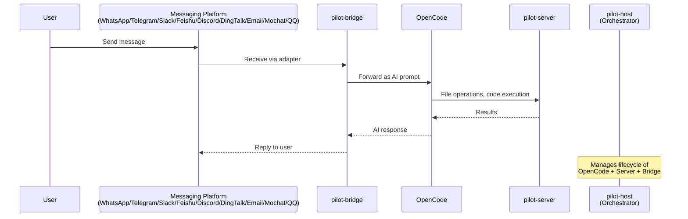

# Guide: apps/pilot — Pilot Suite

The **Pilot Suite** is a collection of tools that bridge AI agents (OpenCode) with messaging platforms and local execution environments.

## Components

```
apps/pilot/
├── host/       # @cofy-x/deck-pilot-host    — Headless CLI orchestrator
├── server/     # @cofy-x/deck-pilot-server   — Filesystem API server
└── bridge/     # @cofy-x/deck-pilot-bridge   — Messaging bridge (WhatsApp, Telegram, Slack, Feishu, Discord, DingTalk, Email, Mochat, QQ)
```

## Architecture



## Component Details

### pilot-host (Orchestrator)

The main entry point. Manages the lifecycle of all Pilot components.

- **Binary:** `pilot` / `pilot-host`
- **Role:** Starts and supervises OpenCode, pilot-server, and pilot-bridge processes. Supports external service mode via `--opencode-url`/`PILOT_OPENCODE_URL`, `--pilot-url`/`PILOT_URL`, and `--bridge-url`/`PILOT_BRIDGE_URL`.
- **Dependencies:** `@cofy-x/deck-pilot-bridge`, `@cofy-x/deck-pilot-server`, `@opencode-ai/sdk`

### pilot-server (Filesystem API)

Provides a filesystem and project context API for AI tools.

- **Binary:** `pilot-server`
- **Role:** Serves file read/write, search, and project metadata endpoints.
- **Dependencies:** Minimal (jsonc-parser, minimatch, yaml)

### pilot-bridge (Messaging Bridge)

Connects AI sessions to messaging platforms.

- **Binary:** `pilot-bridge`
- **Adapters:** WhatsApp (Baileys), Telegram (grammY), Slack (Bolt), Feishu, Discord, DingTalk, Email, Mochat, QQ
- **Features:**
  - SQLite-backed message persistence (better-sqlite3)
  - Typing indicators and event streaming
  - Model selection and multi-session support
  - CLI management commands

## Development

```bash
# Full setup (install, build all components)
pnpm run pilot:setup

# Build all Pilot packages
pnpm run pilot:build

# Run in dev mode (starts host which orchestrates everything)
pnpm run pilot:dev

# Link globally (for CLI usage)
pnpm run pilot:link

# Unlink
pnpm run pilot:unlink
```

## Independent Debug and Test (External OpenCode)

When OpenCode is already running, use external mode to debug each Pilot component independently:

```bash
# Build + tests
make pilot-build
make pilot-test

# Run standalone
make pilot-run-server
make pilot-run-bridge
make pilot-run-host-external

# Aggregate health check (OpenCode + server + bridge)
make pilot-status
```

`pilot-host start|serve` also supports mixed external mode:

- external OpenCode only (host still starts pilot-server + bridge)
- external OpenCode + external pilot-server
- external OpenCode + external bridge
- all services external (health verification + payload output, then exit 0)

VS Code launch profiles support both `dist` and `tsx` flows:

- `Pilot Host (External OpenCode, dist|tsx)`
- `Pilot Server (External OpenCode, dist|tsx)`
- `Pilot Bridge (External OpenCode, dist|tsx)`
- Compound: `Pilot Server + Bridge (dist|tsx)`

Copy `.vscode/pilot.local.env.example` to `.vscode/pilot.local.env` before launching debug profiles.

## Configuration

- **Bridge:** Copy `apps/pilot/bridge/.env.example` to `.env` and configure:
  - Messaging platform credentials (WhatsApp, Telegram, Slack, Feishu, Discord, DingTalk, Email, Mochat, QQ)
  - OpenCode API settings
- **Host:** Uses `opencode.json` for OpenCode configuration.

## Design References

- [docs/design/pilot/README.md](../docs/design/pilot/README.md)
- [docs/design/pilot/host.md](../docs/design/pilot/host.md)
- [docs/design/pilot/bridge.md](../docs/design/pilot/bridge.md)
- [docs/design/pilot/server.md](../docs/design/pilot/server.md)
