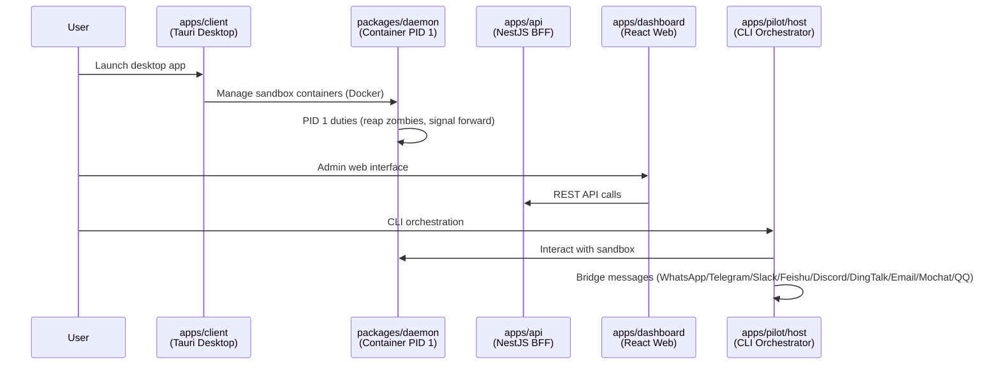

# Project Overview

**deck** is a polyglot monorepo by **cofy-x** for AI-driven infrastructure and developer tools. It provides a secure, local-first sandbox for autonomous AI agents, along with a desktop cockpit and a messaging bridge suite (Pilot).

## Workspace Managers

| Language | Manager | Config File | Workspace Members |
| :--- | :--- | :--- | :--- |
| Node.js / TypeScript | `pnpm` | `pnpm-workspace.yaml` | apps/api, apps/dashboard, apps/landing, apps/client, apps/pilot/*, packages/core-ts, packages/client-daemon-ts |
| Python | `uv` | `pyproject.toml` | apps/server-py, packages/core-py |
| Go | `go work` | `go.work` | apps/cli, packages/daemon, packages/core-go, packages/computer-use, packages/client-daemon-go |
| Rust | `cargo` | `apps/client/src-tauri/Cargo.toml` | Tauri backends |

## Directory Structure

```
deck/
├── apps/                          # Deployable applications
│   ├── api/                       # NestJS BFF (Fastify, Drizzle, BullMQ, PostgreSQL, Redis)
│   ├── cli/                       # Go CLI — MCP tool server for AI agent sandbox ops
│   ├── client/                    # Tauri v2 desktop app — AI sandbox cockpit
│   ├── dashboard/                 # React + Vite admin web UI
│   ├── landing/                   # React + Vite marketing website
│   ├── pilot/                     # Pilot suite
│   │   ├── bridge/                # Messaging bridge (WhatsApp, Telegram, Slack, Feishu, Discord, DingTalk, Email, Mochat, QQ)
│   │   ├── host/                  # Headless CLI orchestrator
│   │   └── server/                # Filesystem API server for sandboxes
│   ├── server-go/                 # Placeholder (reserved for future Go server module)
│   └── server-py/                 # Python AI/ML services (placeholder)
│
├── packages/                      # Shared libraries
│   ├── core-ts/                   # Shared TS business logic and types
│   ├── core-py/                   # Shared Python logic (placeholder)
│   ├── core-go/                   # Shared Go utilities
│   ├── daemon/                    # Go daemon — PID 1 init process for sandbox containers
│   ├── computer-use/              # Go plugin — visual automation (mouse, keyboard, screenshots)
│   ├── client-daemon-ts/          # TypeScript SDK for daemon API (auto-generated)
│   ├── client-daemon-go/          # Go SDK for daemon API (auto-generated)
│   ├── hooks/                     # Shared React hooks (placeholder)
│   └── ui/                        # Shared UI component library (placeholder)
│
├── docker/                        # Dockerfiles for sandbox images
│   ├── desktop/                   # Desktop sandbox (X11, VNC, supervisord)
│   │   ├── runtime-base/          # Base Ubuntu + desktop environment
│   │   ├── runtime-dev/           # + dev tools (Node, Go, Rust, Python)
│   │   ├── runtime-ai/            # + AI tools (OpenCode)
│   │   └── sandbox-ai/            # + daemon + computer-use + CLI (final image)
│   ├── cli/                       # CLI-only sandbox (no desktop)
│   │   ├── runtime-base/          # Base Ubuntu
│   │   ├── runtime-ai/            # + AI tools
│   │   └── sandbox-ai/            # + daemon + CLI (final image)
│   └── plugins/
│       └── computer-use/          # Computer-use plugin Docker build
│
├── deploy/
│   ├── local/                     # docker-compose for local dev (Redis, DB)
│   └── landing/                   # docker-compose for landing deployment
│
├── docs/
│   ├── design/daemon.md           # Daemon PID 1 technical design
│   ├── design/landing-deploy.md   # Landing image deployment runbook
│   └── opencode/                  # OpenCode API reference
│
├── scripts/                       # Build and codegen scripts (JS)
├── hack/                          # One-off setup scripts
└── examples/                      # Example configs (placeholder)
```

Use `.x/module-status.md` as the lifecycle source of truth (`ACTIVE`, `PLACEHOLDER`, `HISTORICAL`, `GENERATED`).

## Key Architecture Relationships



## Root Configuration Files

| File | Purpose |
| :--- | :--- |
| `package.json` | Root pnpm workspace definition, shared scripts, devDependencies |
| `pnpm-workspace.yaml` | pnpm workspace member list |
| `pyproject.toml` | Python workspace (uv) member list |
| `go.work` | Go workspace module list |
| `tsconfig.json` | Root TypeScript config (all TS projects extend this) |
| `eslint.config.js` | Shared ESLint flat config for the entire project |
| `Makefile` | Universal entry point for build, test, lint, and Docker tasks |
| `.prettierrc.json` | Prettier formatting config |
| `.nvmrc` | Node.js version pin |
| `.python-version` | Python version pin |

## Common Development Commands

```bash
# Install all dependencies
make install              # pnpm install + go mod download

# Build
make build                # Build all (TS + Go)
make build-ts             # Build TypeScript projects only
make build-go             # Build Go binaries only
make build-linux          # Cross-compile Go for Linux/AMD64

# Test & Lint
make test                 # Run all tests
make lint                 # Run ESLint + golangci-lint

# Docker sandbox images
make build-desktop-sandbox-ai   # Build full desktop sandbox image
make build-cli-sandbox-ai       # Build CLI-only sandbox image

# Run individual apps
make run-api              # Start NestJS API (dev mode)
make run-dashboard        # Start React dashboard (dev mode)
make run-landing          # Start React landing (dev mode)
make dev-py               # Sync and run Python server

# Pilot suite
pnpm run pilot:setup      # Install + build Pilot
pnpm run pilot:dev        # Run Pilot host in dev mode

# SDK generation
make gen-sdk              # Generate TS + Go SDKs from daemon Swagger
```
