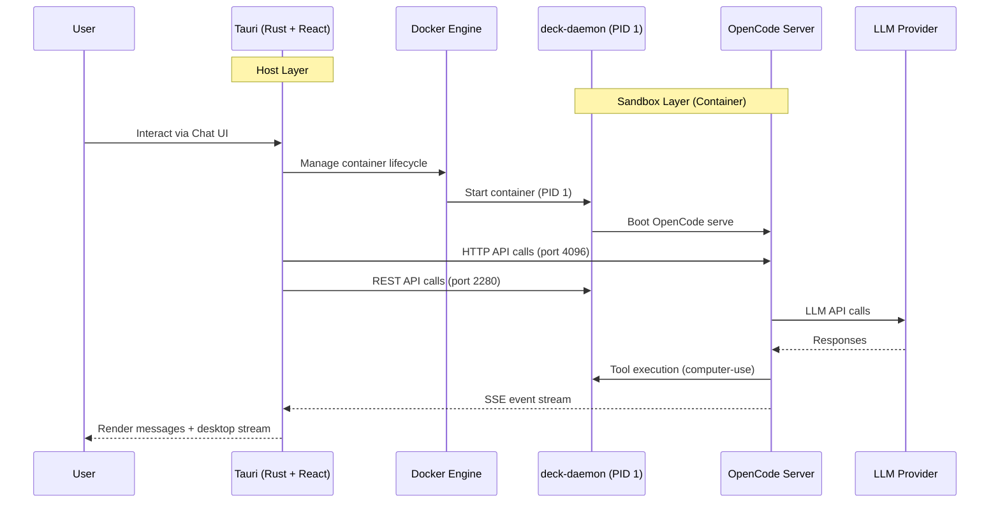
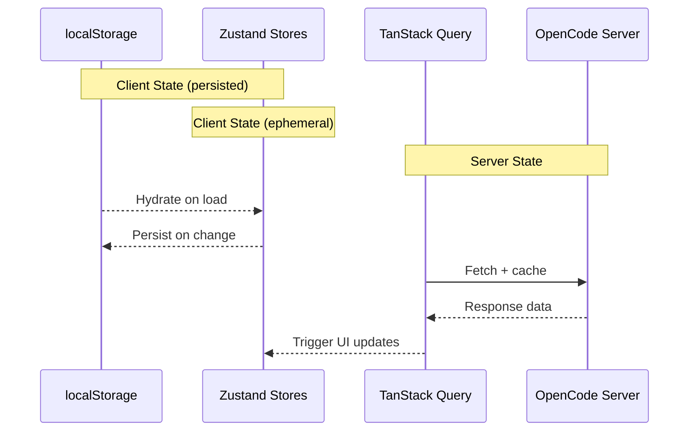
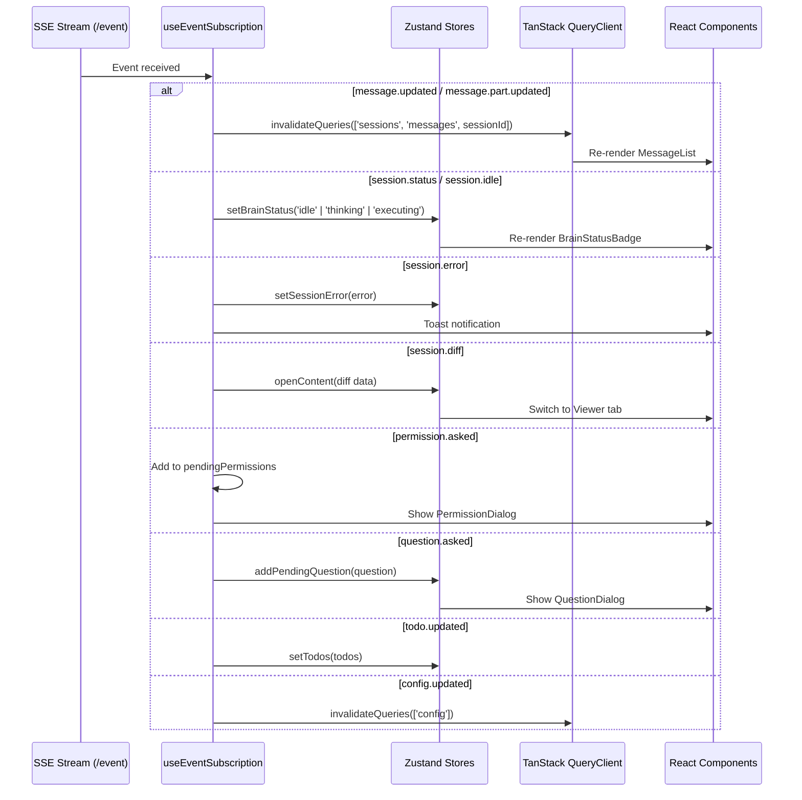
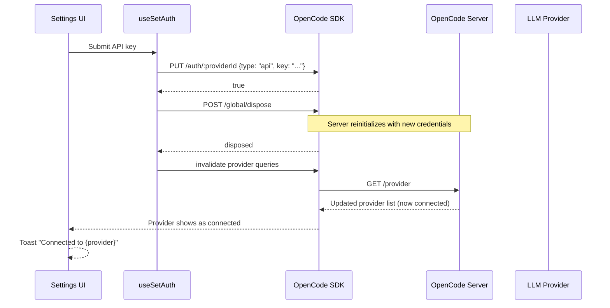
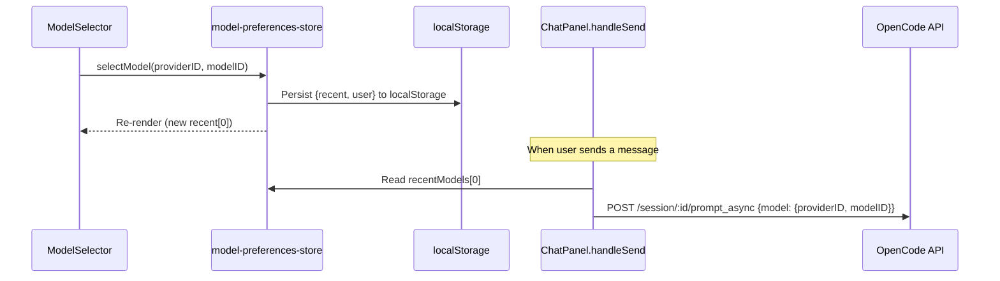

# Architecture Design: Deck AI v0.1

## 1. System Overview

Deck follows a **Three-Tier Separation** model isolating the UI, the Brain, and the Execution environment.

| Layer | Component | Technology | Responsibility |
|:---|:---|:---|:---|
| **Host Layer** | Tauri Client | Rust + React 19 | Desktop shell, Docker management, UI rendering |
| **Agent Layer** | OpenCode Server | Node.js/TS | LLM reasoning, tool execution, session management, SSE events |
| **Sandbox Layer** | Deck Container | Ubuntu + Go daemon | PID 1 process, desktop GUI (Xfce), computer-use APIs |



---

## 2. The Sandbox Layer

### 2.1 Docker Image Architecture (4-Tier)

| Layer | Name | Contents | Rebuild Frequency |
|:---|:---|:---|:---|
| **L1** | `desktop-runtime-base` | Ubuntu 24.04, Xfce, VNC, SSH, `deck` user | Rare |
| **L2** | `desktop-runtime-dev` | Chrome, Go, Node.js (NVM), Python, Zsh | Occasional |
| **L3** | `desktop-runtime-ai` | Claude Code, Gemini CLI, OpenCode | Weekly |
| **L4** | `desktop-sandbox-ai` | `deck-daemon` binary, `computer-use` binary | Frequent |

> Reference: [docker/desktop/sandbox-ai/README.md](../../docker/desktop/sandbox-ai/README.md)

### 2.2 deck-daemon (PID 1)

The daemon runs as the container's init process. Key responsibilities:

- **Zombie Reaping**: Listens for `SIGCHLD` and uses `syscall.Wait4` with `WNOHANG` to prevent zombie process accumulation
- **Service Orchestration**: Boots `Xvfb` -> `D-Bus` -> `Xfce4` -> `x11vnc` -> `noVNC` in sequence
- **Control API**: REST endpoints at port 2280 for mouse/keyboard input, screenshots, browser control, and process management
- **Privilege Separation**: Starts as root but runs desktop and dev tools as the `deck` user (UID 1000)

> Reference: [docs/design/daemon.md](../../docs/design/daemon.md)

### 2.3 OpenCode Server

Runs inside the container via `opencode serve --hostname 0.0.0.0 --port 4096`, exposed to the host.

Key API categories used by Deck:

| Category | Endpoints | Purpose |
|:---|:---|:---|
| **Session** | `POST /session`, `POST /session/:id/prompt_async` | Create sessions, send prompts |
| **Messages** | `GET /session/:id/message` | Fetch conversation history |
| **Events** | `GET /event` (SSE) | Real-time event streaming |
| **Config** | `GET /global/config`, `PATCH /config` | Read/write configuration |
| **Provider** | `GET /provider`, `PUT /auth/:id` | Provider management and auth |
| **Agent** | `GET /agent` | List available agents |
| **Status** | `GET /mcp`, `GET /lsp`, `GET /formatter` | Service health checks |
| **Lifecycle** | `POST /global/dispose` | Reinitialize server after config changes |
| **Files** | `GET /find/file` | Directory/file search |
| **Path** | `GET /path` | System path information |

> Reference: [docs/opencode/overview.md](../../docs/opencode/overview.md)

---

## 3. The Host Layer (Tauri 2.0)

### 3.1 Rust Backend (`src-tauri/`)

```
src-tauri/
├── src/
│   ├── main.rs              # Entry point
│   ├── lib.rs               # Tauri commands + plugin init
│   └── sandbox/
│       ├── mod.rs            # Type exports
│       ├── config.rs         # SandboxConfig, SandboxPorts, defaults
│       └── docker.rs         # Docker CLI operations
├── capabilities/
│   └── default.json          # Permission scoping
└── Cargo.toml
```

#### Tauri Commands

| Command | Purpose |
|:---|:---|
| `check_docker` | Check Docker availability via `docker info` |
| `get_sandbox_status` | Query container running state and port mappings |
| `start_sandbox` | Pull image (if needed) + start container with port mappings |
| `stop_sandbox` | Stop and remove the container |
| `log_api_call` | Log frontend API calls to backend console (dev mode) |

#### Port Mappings

| Port | Service |
|:---|:---|
| 4096 | OpenCode HTTP API |
| 5901 | VNC (raw) |
| 6080 | noVNC (web) |
| 2280 | Deck Daemon REST API |
| 22220 | SSH |
| 22222 | Web Terminal (WebSocket) |

#### Container Start Command

The container is started with `opencode serve --hostname 0.0.0.0 --port 4096 --cors http://localhost:1420` as the entry command, executed by the daemon.

### 3.2 React Frontend (`src/`)

```
src/
├── components/
│   ├── chat/           # Chat panel, messages, input, dialogs
│   ├── config/         # Model/provider/agent selectors, settings
│   ├── layout/         # CockpitLayout (root layout)
│   ├── project/        # Project picker dialog
│   ├── sandbox/        # Sandbox view, toolbar, status badges
│   ├── status/         # Server status bar (MCP/LSP/Fmt)
│   ├── ui/             # shadcn/ui primitives (22 components)
│   └── viewer/         # Code/Diff/Markdown/Image viewer
├── hooks/              # TanStack Query hooks + OpenCode client
├── lib/                # Utilities (SDK client, daemon API, Shiki, etc.)
├── stores/             # Zustand state stores (6 stores)
├── routes/             # TanStack Router file-based routes
├── main.tsx            # App entry point
└── index.css           # Tailwind v4 theme + global styles
```

---

## 4. State Management Architecture

### 4.1 State Categories

Deck separates state into three categories:



### 4.2 Zustand Stores

| Store | Persisted | Key State |
|:---|:---|:---|
| `chat-store` | No | `activeSessionId`, `brainStatus`, `inputText`, `selectedAgent`, `pendingQuestions`, `sessionError`, `todos` |
| `config-store` | No | `settingsOpen` |
| `model-preferences-store` | Yes | `user` (model visibility list), `recent` (recently used models), `variant` |
| `project-store` | Partial | `currentDirectory` (persisted), `projectPickerOpen` (ephemeral) |
| `sandbox-store` | No | `status`, `errorMessage`, `dockerAvailable` |
| `viewer-store` | No | `mode` (desktop/viewer), `content` (current viewer content) |

### 4.3 TanStack Query Hooks

| Hook | Query Key | Refetch Interval | Source |
|:---|:---|:---|:---|
| `useConfig` | `['config']` | Manual | `GET /global/config` |
| `useProviders` | `['config', 'providers']` | Manual | `GET /provider` |
| `useAgents` | `['config', 'agents']` | Manual | `GET /agent` |
| `useSessionList` | `['sessions', 'list', ?dir]` | 10s | `GET /session` |
| `useSessionMessages` | `['sessions', 'messages', id]` | 2s | `GET /session/:id/message` |
| `useMcpStatus` | `['server-status', 'mcp']` | 15s | `GET /mcp` |
| `useLspStatus` | `['server-status', 'lsp']` | 15s | `GET /lsp` |
| `useFormatterStatus` | `['server-status', 'formatter']` | 30s | `GET /formatter` |
| `useDockerCheck` | `['docker-check']` | Manual | Tauri `check_docker` |
| `useSandboxStatus` | `['sandbox-status']` | 5s | Tauri `get_sandbox_status` |

---

## 5. SSE Event System

The frontend subscribes to `GET /event` for real-time updates. The `useEventSubscription` hook manages the SSE lifecycle.

### 5.1 Event Processing



### 5.2 Handled Event Types

| Event Type | Action |
|:---|:---|
| `message.updated` | Invalidate message queries |
| `message.part.updated` | Invalidate message queries |
| `message.removed` | Invalidate message queries |
| `session.status` | Update brain status (idle/thinking/executing) |
| `session.idle` | Set brain to idle, refresh messages |
| `session.error` | Show error banner + toast |
| `session.compacted` | Refresh messages, info toast |
| `session.created/updated/deleted` | Invalidate session list |
| `session.diff` | Open diff in viewer, info toast |
| `permission.asked/replied` | Manage permission dialog queue |
| `question.asked/replied/rejected` | Manage question dialog queue |
| `todo.updated` | Update todo list |
| `command.executed` | Refresh messages |
| `config.updated` | Invalidate config queries |

### 5.3 Reconnection Strategy

- On SSE stream error, wait 2 seconds then reconnect
- On reconnection, sync brain status via `GET /session/status`

---

## 6. OpenCode SDK Integration

### 6.1 Client Creation (`lib/opencode.ts`)

The OpenCode SDK client is created with a custom Tauri-aware fetch wrapper:

1. **Tauri HTTP Plugin**: Uses `@tauri-apps/plugin-http` fetch to bypass CORS in the webview
2. **Dev Logging**: In development mode, all API calls are intercepted and forwarded to the Tauri backend console via the `log_api_call` command
3. **Health Waiting**: `waitForHealthy()` polls `GET /global/health` until the server responds or times out

```typescript
// Client creation pattern
const client = createClient('http://127.0.0.1:4096');
const result = await client.session.list();
const sessions = unwrap(result); // Extract data or throw
```

### 6.2 SDK Result Unwrapping

All SDK methods return `{ data, error, response }`. The `unwrap()` helper:
- Returns `data` if present
- Throws a structured error if `error` is present
- Provides consistent error handling across all hooks

### 6.3 Provider Authentication Flow



> **Critical**: The `POST /global/dispose` call is essential after any credential change. Without it, the backend will not pick up new credentials until restart.

---

## 7. Model Selection Architecture

Model selection is handled **entirely client-side**, matching the official OpenCode web UI behavior.

### 7.1 Data Flow



### 7.2 Store Structure (`model-preferences-store`)

```typescript
interface ModelPreferencesState {
  // Curated list of models with show/hide visibility
  user: Array<{ providerID: string; modelID: string; visibility: 'show' | 'hide' }>;

  // Ordered by most recently used (index 0 = active model)
  recent: Array<{ providerID: string; modelID: string }>;

  // Reserved for future model variant overrides
  variant: Record<string, string>;
}
```

### 7.3 Model Filtering Logic

The `ModelSelector` dropdown filters models as follows:

1. If `user[]` is empty (no preferences set): show all connected, non-deprecated models
2. If `user[]` has entries: show only models with `visibility === 'show'` whose provider is connected
3. Models from disconnected providers are always grayed out and unselectable

---

## 8. Component Architecture

### 8.1 Component Hierarchy

```
CockpitLayout
├── Header (top bar)
│   ├── Logo + Project Indicator
│   ├── ServerStatusBar (MCP/LSP/Formatter status)
│   └── SandboxStatusBadge + Settings button
│
├── ResizablePanelGroup (horizontal)
│   ├── ChatPanel (left, 35-50%)
│   │   ├── Header (title, project badge, brain status, model selector, new session)
│   │   ├── SessionListItem[] (scrollable, max-h-36)
│   │   ├── SessionErrorBanner (conditional)
│   │   ├── MessageList (flex-1, scrollable)
│   │   │   └── MessageItem[]
│   │   │       ├── MarkdownRenderer (text parts)
│   │   │       ├── ReasoningBlock (reasoning parts)
│   │   │       ├── ToolCallLog (tool-invocation parts)
│   │   │       └── StepPart (step parts)
│   │   ├── ChatInput (agent selector, file attach, textarea, send)
│   │   ├── PermissionDialog (modal)
│   │   └── QuestionDialog (modal)
│   │
│   └── RightPanel (right, 50-65%)
│       ├── Tab Switcher (Desktop / Viewer)
│       ├── SandboxView (when Desktop tab)
│       │   ├── SandboxToolbar
│       │   ├── BootProgress (during boot)
│       │   └── noVNC iframe (when ready)
│       └── ContentViewer (when Viewer tab)
│           ├── ViewerToolbar
│           ├── CodeViewer | MarkdownViewer | DiffViewer | ImageViewer
│           └── EmptyViewer (no content)
│
├── SettingsSheet (slide-out from right)
│   ├── ProviderList + ProviderAuthDialog + CustomProviderDialog
│   └── ModelTogglesSection
│
└── ProjectPickerDialog (modal)
```

### 8.2 Key Design Patterns

#### Flexbox Height Chain

For scrollable content areas to work correctly, every `flex-1` container in the chain must have `min-h-0` to override the default `min-height: auto`. Without this, flex items won't shrink below their content height, and `ScrollArea` or `overflow-auto` won't detect overflow.

```
div.h-screen.flex-col             -- Root
  header.h-10.shrink-0            -- Fixed header
  main.min-h-0.flex-1             -- Shrinkable main area
    ResizablePanel
      div.h-full.flex-col
        div.h-10.shrink-0         -- Panel header
        div.min-h-0.flex-1        -- Content area
          ScrollArea.h-full       -- Scrollable content
```

> **IMPORTANT for future development**: Always add `min-h-0` alongside `flex-1` when the container needs to scroll. This is the most common layout bug in the codebase.

#### Message Content Overflow Prevention

- Code blocks in chat messages are constrained to `max-h-[400px] overflow-auto` to prevent them from dominating the viewport
- Message content containers use `min-w-0` to prevent wide content (long code lines) from forcing horizontal overflow
- The message list uses a single `overflow-y-auto` div (NOT nested ScrollArea) for reliable scrolling

#### Zustand Selector Pattern

When a component needs to re-render on state change, subscribe to **data** directly:

```typescript
// CORRECT: Re-renders when recentModels changes
const recentModels = useModelPreferencesStore((s) => s.recent);

// WRONG: Function reference is stable, component won't re-render
const getActiveModelKey = useModelPreferencesStore((s) => s.getActiveModelKey);
```

---

## 9. Technology Stack Summary

### Frontend

| Category | Technology | Version |
|:---|:---|:---|
| Framework | React | 19 |
| Build Tool | Vite | 7 |
| Language | TypeScript | 5 (strict) |
| Routing | TanStack Router | 1 |
| Server State | TanStack Query | 5 |
| Client State | Zustand | 5 |
| Styling | Tailwind CSS | 4 |
| UI Library | shadcn/ui (Radix) | Latest |
| Icons | Lucide React | Latest |
| Markdown | react-markdown + remark-gfm | Latest |
| Syntax Highlighting | Shiki | 3 |
| Notifications | Sonner | 2 |
| AI SDK | @opencode-ai/sdk | 1.2.6 |
| Desktop | Tauri | 2 |

### Backend (Tauri/Rust)

| Category | Technology |
|:---|:---|
| Runtime | Tauri 2.0 |
| Language | Rust 2021 |
| Async | Tokio |
| Serialization | Serde + serde_json |
| Plugins | dialog, http, opener, process, shell |

### Sandbox

| Category | Technology |
|:---|:---|
| Container | Docker (OCI) |
| Base OS | Ubuntu 24.04 |
| Desktop | Xfce4 + Xvfb (1280x720) |
| VNC | x11vnc + noVNC |
| Init | deck-daemon (Go) |
| AI Engine | OpenCode Server (Node.js) |
| Languages | Go 1.25, Node.js 24, Python 3.12 |
| AI Tools | Claude Code, Gemini CLI, OpenCode CLI |

---

## 10. API Call Logging (Dev Mode)

All frontend API calls are logged to the Tauri backend console in development mode.

### Flow

1. `lib/opencode.ts` wraps the SDK's fetch function
2. Before each request, captures method, URL, and body
3. After response, captures status, duration, and response preview (truncated to 500 chars)
4. Sends the log entry to the Rust backend via the `log_api_call` Tauri command
5. Rust prints formatted output to `stdout`

### Log Format

```
[API] GET http://127.0.0.1:4096/provider (245ms) -> 200
[API] POST http://127.0.0.1:4096/session/abc123/prompt_async (1523ms) -> 204
  Body: {"parts":[{"type":"text","text":"Hello"}],"model":{"providerID":"anthropic","modelID":"claude-sonnet-4-20250514"}}
```

---

## 11. Development Workflow

### Adding New Features

1. **Define the hook**: Create a TanStack Query hook in `hooks/` that calls the OpenCode SDK
2. **Create/update store**: If client-side state is needed, add to an existing Zustand store or create a new one
3. **Build the component**: Use shadcn/ui primitives in `components/ui/`, compose in feature directories
4. **Wire SSE events**: If the feature has server-sent events, add handling in `useEventSubscription`
5. **Test the layout**: Ensure all `flex-1` containers have `min-h-0`, verify scrolling works

### Adding a shadcn/ui Component

```bash
cd apps/client
pnpm dlx shadcn@latest add <component-name>
```

Components are placed in `src/components/ui/` and can be freely modified.

### Lint & Type Check

```bash
# From workspace root
pnpm run lint

# From apps/client
pnpm tsc --noEmit
```

### Common Pitfalls

| Issue | Solution |
|:---|:---|
| ScrollArea not scrolling | Add `min-h-0` to all `flex-1` ancestors in the layout chain |
| Model selector not updating | Use data selectors from Zustand, not function selectors |
| Provider status not refreshing after auth | Ensure `global.dispose()` is called after credential changes |
| API calls not visible in dev tools | Use Tauri backend console (API logging via `log_api_call`) |
| Code blocks overflowing chat | Apply `max-h-[400px] overflow-auto` to code block containers |
| Wide content breaking layout | Add `min-w-0` to flex children that may contain wide content |

---

## 12. File Reference

### Stores

| File | Description |
|:---|:---|
| `stores/chat-store.ts` | Active session, brain status, input text, agent, pending questions, errors, todos |
| `stores/config-store.ts` | Settings panel open/close state |
| `stores/model-preferences-store.ts` | Model visibility and selection (persisted to localStorage) |
| `stores/project-store.ts` | Current project directory (partially persisted) |
| `stores/sandbox-store.ts` | Container lifecycle status, Docker availability |
| `stores/viewer-store.ts` | Right panel mode (desktop/viewer), viewer content |

### Hooks

| File | Hooks | Purpose |
|:---|:---|:---|
| `hooks/use-config.ts` | `useConfig`, `useUpdateConfig`, `useProviders`, `useAgents`, `useProviderAuthMethods`, `useSetAuth`, `useRemoveAuth`, `useAddCustomProvider` | OpenCode configuration and provider management |
| `hooks/use-session.ts` | `useSessionList`, `useSessionMessages`, `useCreateSession`, `useSendPrompt`, `useReplyPermission`, `useQuestionReply`, `useAbortSession`, `useEventSubscription` | Session lifecycle and SSE event handling |
| `hooks/use-sandbox.ts` | `useDockerCheck`, `useSandboxStatus`, `useStartSandbox`, `useStopSandbox` | Docker container management (via Tauri commands) |
| `hooks/use-opencode-client.ts` | `useOpenCodeClient` | Singleton SDK client (null when sandbox not running) |
| `hooks/use-project.ts` | `usePaths`, `useFindDirectories` | Path queries and directory search |
| `hooks/use-server-status.ts` | `useMcpStatus`, `useLspStatus`, `useFormatterStatus` | Service health monitoring |
| `hooks/use-daemon.ts` | `useDaemonHealth`, `useComputerUseStatus` | Daemon health and computer-use status |

### Libraries

| File | Purpose |
|:---|:---|
| `lib/opencode.ts` | OpenCode SDK client factory, `unwrap()` helper, health polling, dev API logging |
| `lib/daemon.ts` | Daemon REST API client (computer-use start/stop/status, noVNC probe) |
| `lib/shiki.ts` | Singleton Shiki highlighter (20+ languages) |
| `lib/constants.ts` | Port mappings, base URLs, container name, default image, resolution |
| `lib/utils.ts` | `cn()` class merge, `isTauriRuntime()`, `formatRelativeTime()` |

### Key Components

| File | Purpose |
|:---|:---|
| `components/layout/cockpit-layout.tsx` | Root layout: header, resizable panels, settings sheet, dialogs |
| `components/chat/chat-panel.tsx` | Main chat interface: sessions, messages, input, dialogs |
| `components/chat/message-list.tsx` | Scrollable message list with auto-scroll |
| `components/chat/message-item.tsx` | Individual message rendering (text, tools, reasoning, steps) |
| `components/chat/chat-input.tsx` | Multi-line input with agent selector and file attachments |
| `components/chat/markdown-renderer.tsx` | Markdown rendering with Shiki code highlighting |
| `components/config/model-selector.tsx` | Model selection dropdown (grouped by provider) |
| `components/config/settings-sheet.tsx` | Settings panel (providers, models, config) |
| `components/config/provider-auth-dialog.tsx` | Provider authentication dialog (API key + OAuth) |
| `components/config/custom-provider-dialog.tsx` | Custom provider configuration dialog |
| `components/sandbox/sandbox-view.tsx` | Sandbox boot sequence and noVNC iframe |
| `components/viewer/content-viewer.tsx` | Code/Markdown/Diff/Image viewer orchestrator |
| `components/viewer/right-panel.tsx` | Tab switching between Desktop and Viewer |
| `components/status/server-status-bar.tsx` | MCP/LSP/Formatter status indicators |
| `components/project/project-picker-dialog.tsx` | Project directory selection dialog |
