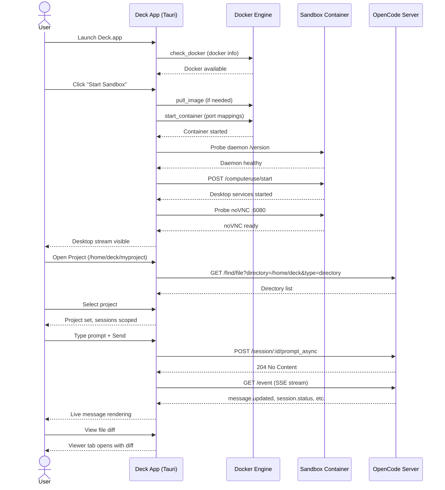

# Product Design: Deck AI v0.1

## 1. Product Vision

**Deck** is a secure, autonomous "AI Cockpit" that bridges the gap between Large Language Models and local desktop operations. It provides a physical "body" (a Linux sandbox) and "eyes" (a GUI) for AI agents to perform complex, multi-step tasks within a zero-trust container environment.

v0.1 delivers the foundational end-to-end pipeline: sandbox lifecycle, AI chat with OpenCode, model/provider management, and real-time file viewing.

---

## 2. Target Users

| Persona | Pain Point | Deck Solution |
|:---|:---|:---|
| **Developers** | Running untrusted scripts or complex toolchains locally | A hardened sandbox with Go/Node/Python and an AI agent to manage them |
| **Data Researchers** | Web scraping sites without APIs | AI-driven "Computer Use" to navigate browsers like a human |
| **Automation Enthusiasts** | Connecting apps that don't talk to each other | A unified AI interface that can "see" and "click" across any GUI |

---

## 3. Core Product Principles

- **Safety First (Zero-Trust)**: AI actions never touch the host OS directly
- **Zero-Config (Out of the Box)**: One click to launch; Docker is managed invisibly
- **Live Transparency**: Users watch the AI's "thought process" and "physical actions" in real-time
- **Extensibility**: Open-source Skill/Tool system based on MCP (Model Context Protocol)

---

## 4. Functional Requirements (v0.1)

### 4.1 Sandbox Lifecycle

- **Docker Detection**: On launch, the app checks for Docker/OrbStack availability via `docker info`
- **Auto-Bootstrapping**: If the image is missing, it is pulled automatically with a progress animation
- **Container Start**: Launches the `deck/desktop-sandbox-ai` image with port mappings for OpenCode (4096), VNC (5901), noVNC (6080), Daemon (2280), SSH (22220), and Web Terminal (22222)
- **Boot Sequence**: Multi-stage initialization: Daemon health check -> Computer-use start -> noVNC probe -> Ready
- **Status Tracking**: Real-time status badges (idle, checking, pulling, starting, running, stopping, error)

### 4.2 AI Chat Interface

- **Multi-Turn Sessions**: Create, list, and switch between sessions scoped to a project directory
- **Prompt Submission**: Send text prompts with optional file attachments, agent selection, and model override
- **Real-Time Streaming**: SSE (Server-Sent Events) for live message updates, status changes, and tool execution
- **Message Rendering**: Rich markdown with GitHub Flavored Markdown, syntax-highlighted code blocks (Shiki, 20+ languages)
- **Tool Call Logs**: Collapsible display of each tool invocation with state (running, success, error) and arguments
- **Reasoning Blocks**: Expandable "Thinking" sections showing the AI's chain-of-thought reasoning
- **Permission Dialogs**: Modal prompts when the AI requests permission for sensitive operations (once/always/reject)
- **Question Dialogs**: Modal prompts when the AI asks the user for input
- **Error Handling**: Session error banners with dismissal, toast notifications for transient errors

### 4.3 Model & Provider Configuration

- **Model Selection**: Client-side model switching persisted to `localStorage`, reflected in both Chat header and Settings panel
- **Model Visibility**: Toggle models on/off in Settings; only visible models appear in the Chat model selector
- **Agent Selection**: Dropdown in the chat input area showing primary, non-hidden agents (native agents sorted last)
- **Provider Authentication**: Dialog supporting API key input; OAuth flow support for providers that offer it
- **Custom Providers**: Dialog to add OpenAI-compatible providers with custom `baseURL`, API key, headers, and model definitions
- **Provider Lifecycle**: Connect/disconnect with `global.dispose()` to reinitialize the backend after credential changes

### 4.4 Project Management

- **Project Picker**: Dialog that queries `/find/file` for directories under `/home/deck`
- **Project Scoping**: Sessions are created within the context of the selected project directory
- **Project Persistence**: Selected project directory persists across page reloads via `localStorage`
- **Project Display**: Project name shown in the top bar and chat header with tooltip for full path

### 4.5 Server Status Monitoring

- **Status Bar**: Top bar displays connection status for MCP servers, LSP servers, and Formatters
- **Polling**: Auto-refreshing status every 15-30 seconds
- **Badge Indicators**: Color-coded dots (green=healthy, yellow=partial, red=error, gray=loading)

### 4.6 Content Viewer

- **Code Viewer**: Syntax-highlighted code with line numbers (Shiki)
- **Diff Viewer**: Unified diff display with additions/deletions coloring per file
- **Markdown Viewer**: Full markdown rendering with prose styling
- **Image Viewer**: Zoomable image display
- **Auto-Open**: File diffs from AI operations automatically open in the viewer
- **Toolbar**: Copy content, switch back to desktop, close viewer

---

## 5. UI/UX Specification

### 5.1 The "Cockpit" Layout

The application uses a **Split-Pane View** (resizable, 35-50% left).

```
+---------------------------------------------------------------------+
| [Logo] DeckAI | [Project] | [MCP] [LSP] [Fmt] | [Status] [Settings] |
+---------------------------------------------------------------------+
|                    |                                                 |
|  [Chat] [Brain]   |        [Desktop]  [Viewer]                      |
|  [Model Selector]  |                                                |
|  [+New]            |                                                |
|                    |                                                 |
|  [Session List]    |       noVNC Desktop Stream                     |
|  ---------------   |       (or)                                     |
|                    |       Code/Diff/MD/Image Viewer                |
|  [Messages]        |                                                |
|    - User          |                                                |
|    - Assistant      |                                                |
|      - Tool Calls  |                                                |
|      - Reasoning   |                                                |
|      - Code        |                                                |
|                    |                                                 |
|  ---------------   |                                                 |
|  [Agent] [Input]   |                                                |
|  [Attach] [Send]   |                                                |
+---------------------------------------------------------------------+
```

### 5.2 Left Pane (Intelligence)

1. **Header Bar**: Chat title, project badge, brain status indicator (Idle/Thinking/Executing), model selector dropdown
2. **Session List**: Compact, scrollable list of sessions (max-height 144px) with creation time
3. **Message Area**: Scrollable message list with auto-scroll-to-bottom and manual scroll detection
4. **Input Area**: Multi-line textarea with agent selector, file attachment button, send button

### 5.3 Right Pane (Reality)

Tab-switchable between:
- **Desktop**: noVNC iframe streaming the sandbox's Xfce desktop (1280x720)
- **Viewer**: Content viewer for code, diffs, markdown, and images

### 5.4 User Journey



### 5.5 Settings Panel

A slide-out sheet (from right) containing:

1. **Provider Section**: Collapsible list of all providers with connection status dots, "Connect"/"Disconnect" buttons, and "Add Custom Provider" option
2. **Model Management Section**: Collapsible provider groups with toggle switches for each model's visibility
3. **Configuration Section**: Current OpenCode config display (model, provider defaults)

---

## 6. Data Persistence Strategy

| Data | Storage | Scope |
|:---|:---|:---|
| Model selection (active model) | `localStorage` via Zustand persist | Client-side only |
| Model visibility preferences | `localStorage` via Zustand persist | Client-side only |
| Selected project directory | `localStorage` via Zustand persist | Survives page reload |
| Session history | OpenCode server (in-container) | Lost on container restart |
| Provider credentials | OpenCode server config | Persisted in container state dir |
| UI state (sidebar, dialogs) | Zustand (memory) | Ephemeral |
| Server state (providers, models) | TanStack Query cache | Auto-refreshing |

---

## 7. Error Handling Strategy

| Scenario | Behavior |
|:---|:---|
| Docker not available | Error state with retry button |
| Container start fails | Error status badge + error message display |
| OpenCode server unreachable | Client returns null, queries disabled |
| SSE stream disconnects | Auto-reconnect after 2 second delay |
| Session error (from AI) | Error banner + toast notification |
| Permission timeout | Permission dialog stays open until user responds |
| API call failure | Toast notification with error details |

---

## 8. Security Model

1. **Network Isolation**: All API calls (OpenCode, Daemon, noVNC) are bound to `127.0.0.1` ports mapped from the container
2. **Tauri HTTP Plugin**: Frontend uses Tauri's HTTP plugin to bypass CORS restrictions in the webview
3. **HTTP Scope**: Tauri capabilities restrict HTTP to `http://127.0.0.1:*/*` and `http://localhost:*/*` only
4. **Container Boundary**: AI operations execute inside the Docker container; the host filesystem is not mounted (except optional shared volumes)
5. **Credential Storage**: Provider API keys are stored via OpenCode's auth system inside the container's state directory

---

## 9. Future Roadmap (Post v0.1)

| Feature | Priority | Description |
|:---|:---|:---|
| Session persistence | High | Persist sessions across container restarts |
| Multi-model conversations | Medium | Switch models mid-conversation |
| MCP server management | Medium | Add/remove MCP servers from the UI |
| Keyboard shortcuts | Medium | Global shortcuts for common actions |
| File browser | Medium | Browse and edit files in the sandbox |
| Terminal integration | Low | Web terminal connected to sandbox shell |
| Plugin marketplace | Low | Browse and install MCP plugins |
