**English** | [简体中文](README.zh-CN.md)

<h1 align="center">Deck</h1>

<p align="center">
  <strong>Your local cockpit for autonomous AI agents — secure sandboxes, one desktop app.</strong>
</p>

<p align="center">
  <a href="LICENSE"></a>
  <a href="https://github.com/cofy-x/deck/releases"></a>
  <a href="https://github.com/cofy-x/deck/stargazers"></a>
  <a href="https://github.com/cofy-x/deck/actions/workflows/docker-desktop-images.yml"></a>
</p>

<p align="center">
  <a href="https://github.com/cofy-x/deck" style="display: inline-block; border: 1px solid #e1e4e8; border-radius: 12px; overflow: hidden; box-shadow: 0 10px 30px rgba(0,0,0,0.1); line-height: 0;">
    
  </a>
</p>

> [!NOTE]
> Deck is currently in **prerelease** (`v0.0.1`).
> macOS builds may be unsigned / not notarized. See [install notes](#3-first-launch-on-macos) if Gatekeeper blocks the app.

---

## Why Deck?

🔒 **Local-First Sandboxes** — Spin up isolated Docker containers with a full Linux desktop, dev tools, and AI agents. Your data stays on your machine.

🖥️ **One Cockpit, Two Modes** — Chat with AI on the left, watch it work on a live desktop (noVNC) on the right. Switch between local and remote sandboxes without changing your workflow.

🤖 **AI-Native Architecture** — Built-in OpenCode integration for multi-turn AI sessions with tool execution, file diffs, reasoning traces, and permission controls.

💬 **Messaging Bridge (Pilot)** — Orchestrate AI agents from WhatsApp, Telegram, Slack, Feishu, Discord, DingTalk, Email, and more through a unified bridge suite.

🧩 **Polyglot Monorepo** — TypeScript, Go, Rust, and Python in one repo with pnpm, Go workspaces, Cargo, and uv — everything you need to extend the platform.

📖 **Fully Open Source** — Apache 2.0 licensed. Fork it, extend it, self-host it.

---

## 🚀 Quick Start

### 1. Install the app

Download the latest prerelease from **[GitHub Releases](https://github.com/cofy-x/deck/releases)** and drag `deck.app` into `/Applications`.

### 2. First launch on macOS

If macOS says the app is damaged or blocked:

```bash
xattr -dr com.apple.quarantine /Applications/deck.app
open /Applications/deck.app
```

### 3. Start a sandbox

Open the app, select the built-in **Local** profile, and click **Start Sandbox**.
The app will automatically pull `ghcr.io/cofy-x/deck/desktop-sandbox-ai:latest` on first run with a live progress indicator.

> **Tip:** To pre-pull the image manually:
> ```bash
> docker pull ghcr.io/cofy-x/deck/desktop-sandbox-ai:latest
> ```

---

## 🔨 Build From Source

Prerequisites: **Node.js >= 20**, **pnpm**, **Rust**, **Go**, **Docker**.

```bash
make install

cd apps/client
pnpm tauri dev
```

<details>
<summary>Other active modules</summary>

```bash
# Pilot host
pnpm run pilot:dev

# API + Dashboard
make docker-dev-up
make run-api
make run-dashboard
```

</details>

---

## 🏗️ Architecture

```mermaid
graph LR
  User([User]) --> Client["Deck Client<br/>(Tauri + React)"]
  Client --> Docker["Docker Container"]
  Docker --> Daemon["Daemon (PID 1)"]
  Daemon --> AI["AI Agent<br/>(OpenCode)"]
  Daemon --> Desktop["Linux Desktop<br/>(noVNC)"]
  Daemon --> ComputerUse["Computer Use<br/>(mouse / keyboard)"]

  User --> PilotBridge["Pilot Bridge<br/>(WhatsApp, Telegram, …)"]
  PilotBridge --> PilotHost["Pilot Host"]
  PilotHost --> Daemon
```



---

## Tech Stack

| Layer            | Technologies                                                               |
| :--------------- | :------------------------------------------------------------------------- |
| Desktop App      | Tauri v2, React, TypeScript, Vite, Tailwind CSS, shadcn/ui                 |
| Sandbox Runtime  | Go, Docker, noVNC, X11, supervisord                                        |
| AI Integration   | OpenCode, SSE streaming, MCP tool server                                   |
| Backend Services | NestJS, Fastify, Drizzle ORM, PostgreSQL, Redis, BullMQ                    |
| Messaging Bridge | Node.js, WhatsApp / Telegram / Slack / Feishu / Discord / DingTalk / Email |
| Build & Tooling  | pnpm, Cargo, Go workspaces, uv, Makefile                                   |

---

## Repository Structure

```
deck/
├── apps/
│   ├── client/          # Tauri v2 desktop cockpit (primary v0.0.1 surface)
│   ├── pilot/           # Messaging bridge + orchestration suite
│   │   ├── bridge/      #   WhatsApp, Telegram, Slack, Feishu, Discord, …
│   │   ├── host/        #   Headless CLI orchestrator
│   │   └── server/      #   Filesystem API server for sandboxes
│   ├── api/             # NestJS BFF service
│   ├── dashboard/       # React web admin UI
│   └── cli/             # Go CLI / MCP tool server
├── packages/
│   ├── daemon/          # Go sandbox daemon (container PID 1)
│   ├── computer-use/    # Visual automation plugin (mouse, keyboard, screenshots)
│   ├── core-ts/         # Shared TypeScript logic & types
│   ├── core-go/         # Shared Go utilities
│   ├── client-daemon-ts/# TypeScript SDK for daemon API
│   └── client-daemon-go/# Go SDK for daemon API (generated)
├── docker/              # Multi-stage sandbox image builds
├── deploy/              # Local dev docker-compose
├── docs/                # Design documents & media
└── scripts/             # Build & codegen scripts
```

See [module-status.md](.x/module-status.md) for the full lifecycle matrix.

---

## 🗺️ Roadmap

### v0.0.x — Now

- Stable desktop cockpit with local and remote sandbox workflows.
- Improved session control, desktop visibility, and reliability.
- Sandbox image optimizations and faster boot times.

### v0.1 — Next

- Pilot bridge integration directly in the client.
- Unified desktop and bridge orchestration from one entrypoint.
- Multi-session and multi-sandbox management.
- Enhanced file viewer, diff viewer, and markdown preview.

### Future

- Windows and Linux desktop builds.
- Plugin system for custom sandbox extensions.
- Team collaboration and shared sandbox sessions.

---

## 🤝 Contributing

Contributions are welcome! Please read the [Contributing Guide](CONTRIBUTING.md) before submitting a pull request.

This project follows the [Contributor Covenant Code of Conduct](CODE_OF_CONDUCT.md).

---

## Community

- [GitHub Issues](https://github.com/cofy-x/deck/issues) — Bug reports and feature requests.
- [GitHub Discussions](https://github.com/cofy-x/deck/discussions) — Questions, ideas, and general conversation.
- [Changelog](CHANGELOG.md) — Release history.
- [Security Policy](SECURITY.md) — Responsible disclosure.

---

## ⭐ Star History

[](https://star-history.com/#cofy-x/deck&Date)

---

## License

Deck is licensed under [Apache License 2.0](LICENSE).

<p align="center"><sub>Built with care by <a href="https://github.com/cofy-x">cofy-x</a></sub></p>
