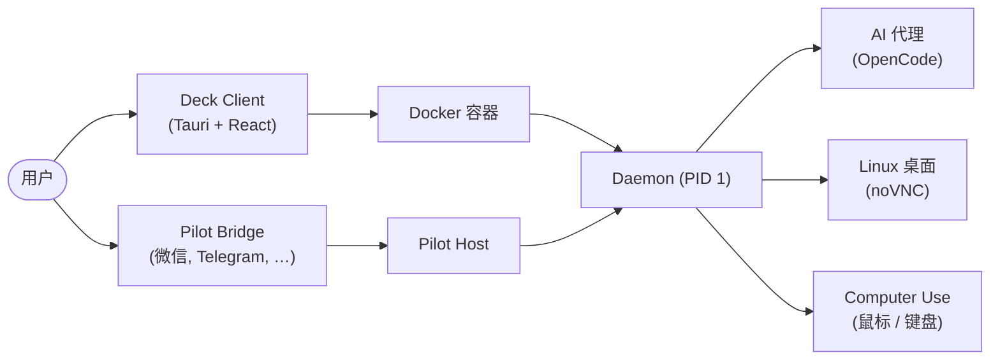

[English](README.md) | **简体中文**

<h1 align="center">Deck</h1>

<p align="center">
  <strong>自主 AI 代理的本地驾驶舱 — 安全沙箱，一个桌面应用搞定。</strong>
</p>

<p align="center">
  <a href="LICENSE"></a>
  <a href="https://github.com/cofy-x/deck/releases"></a>
  <a href="https://github.com/cofy-x/deck/stargazers"></a>
  <a href="https://github.com/cofy-x/deck/actions/workflows/docker-desktop-images.yml"></a>
</p>

<p align="center">
  <a href="https://github.com/cofy-x/deck" style="display: inline-block; border: 1px solid #e1e4e8; border-radius: 12px; overflow: hidden; box-shadow: 0 10px 30px rgba(0,0,0,0.1); line-height: 0;">
    
  </a>
</p>

> [!NOTE]
> Deck 目前处于 **预发布** 阶段（`v0.0.1`）。
> macOS 构建可能未签名/未公证。如果 Gatekeeper 阻止启动，请参阅[安装说明](#3-macos-首次启动)。

---

## 为什么选择 Deck？

🔒 **本地优先沙箱** — 一键启动隔离的 Docker 容器，内置完整 Linux 桌面、开发工具和 AI 代理。数据始终留在你的机器上。

🖥️ **一个驾驶舱，两种模式** — 左侧与 AI 对话，右侧通过 noVNC 实时观察 AI 在桌面上的操作。本地与远程沙箱无缝切换，工作流程不变。

🤖 **AI 原生架构** — 内置 OpenCode 集成，支持多轮 AI 会话、工具调用、文件差异对比、推理追踪和权限控制。

💬 **消息桥接 (Pilot)** — 通过统一的桥接套件，从微信、Telegram、Slack、飞书、Discord、钉钉、邮件等渠道编排 AI 代理。

🧩 **多语言 Monorepo** — TypeScript、Go、Rust、Python 共存一个仓库，使用 pnpm、Go 工作区、Cargo 和 uv 管理 — 扩展平台所需的一切。

📖 **完全开源** — Apache 2.0 许可证。随意 Fork、扩展、自托管。

---

## 🚀 快速开始

### 1. 拉取沙箱镜像

```bash
docker pull ghcr.io/cofy-x/deck/desktop-sandbox-ai:latest
docker tag  ghcr.io/cofy-x/deck/desktop-sandbox-ai:latest deck/desktop-sandbox-ai:latest
```

### 2. 安装应用

从 **[GitHub Releases](https://github.com/cofy-x/deck/releases)** 下载最新的预发布 DMG，将 `deck.app` 拖入 `/Applications`。

### 3. macOS 首次启动

如果 macOS 提示应用已损坏或被阻止：

```bash
xattr -dr com.apple.quarantine /Applications/deck.app
open /Applications/deck.app
```

### 4. 启动沙箱

打开应用，选择内置的 **Local** 配置文件，点击 **Start Sandbox**。

---

## 🔨 从源码构建

前置条件：**Node.js >= 20**、**pnpm**、**Rust**、**Go**、**Docker**。

```bash
make install

cd apps/client
pnpm tauri dev
```

<details>
<summary>其他活跃模块</summary>

```bash
# Pilot host
pnpm run pilot:dev

# API + Dashboard
make docker-dev-up
make run-api
make run-dashboard
```

</details>

---

## 🏗️ 架构概览



---

## 技术栈

| 层级 | 技术 |
| :--- | :--- |
| 桌面应用 | Tauri v2, React, TypeScript, Vite, Tailwind CSS, shadcn/ui |
| 沙箱运行时 | Go, Docker, noVNC, X11, supervisord |
| AI 集成 | OpenCode, SSE 流式传输, MCP 工具服务器 |
| 后端服务 | NestJS, Fastify, Drizzle ORM, PostgreSQL, Redis, BullMQ |
| 消息桥接 | Node.js, 微信 / Telegram / Slack / 飞书 / Discord / 钉钉 / 邮件 |
| 构建工具 | pnpm, Cargo, Go 工作区, uv, Makefile |

---

## 仓库结构

```
deck/
├── apps/
│   ├── client/          # Tauri v2 桌面驾驶舱（v0.0.1 主要产品界面）
│   ├── pilot/           # 消息桥接 + 编排套件
│   │   ├── bridge/      #   微信, Telegram, Slack, 飞书, Discord, …
│   │   ├── host/        #   无头 CLI 编排器
│   │   └── server/      #   沙箱文件系统 API 服务器
│   ├── api/             # NestJS BFF 服务
│   ├── dashboard/       # React Web 管理后台
│   └── cli/             # Go CLI / MCP 工具服务器
├── packages/
│   ├── daemon/          # Go 沙箱守护进程（容器 PID 1）
│   ├── computer-use/    # 视觉自动化插件（鼠标、键盘、截图）
│   ├── core-ts/         # 共享 TypeScript 逻辑与类型
│   ├── core-go/         # 共享 Go 工具库
│   ├── client-daemon-ts/# Daemon API 的 TypeScript SDK
│   └── client-daemon-go/# Daemon API 的 Go SDK（自动生成）
├── docker/              # 多阶段沙箱镜像构建
├── deploy/              # 本地开发 docker-compose
├── docs/                # 设计文档与媒体资源
└── scripts/             # 构建与代码生成脚本
```

完整生命周期矩阵见 [module-status.md](.x/module-status.md)。

---

## 🗺️ 路线图

### v0.0.x — 当前

- 稳定的桌面驾驶舱，支持本地和远程沙箱工作流。
- 改进会话控制、桌面可见性和可靠性。
- 沙箱镜像优化，加快启动速度。

### v0.1 — 下一步

- 在客户端中直接集成 Pilot 桥接功能。
- 统一桌面和桥接编排，提供单一操作入口。
- 多会话和多沙箱管理。
- 增强文件查看器、差异查看器和 Markdown 预览。

### 未来

- Windows 和 Linux 桌面版本。
- 插件系统，支持自定义沙箱扩展。
- 团队协作与共享沙箱会话。

---

## 🤝 参与贡献

欢迎贡献！请在提交 Pull Request 之前阅读[贡献指南](CONTRIBUTING.md)。

本项目遵循[贡献者公约行为准则](CODE_OF_CONDUCT.md)。

---

## 社区

- [GitHub Issues](https://github.com/cofy-x/deck/issues) — Bug 报告与功能请求。
- [GitHub Discussions](https://github.com/cofy-x/deck/discussions) — 问题、想法和日常交流。
- [更新日志](CHANGELOG.md) — 发布历史。
- [安全策略](SECURITY.md) — 负责任的漏洞披露。

---

## ⭐ Star 趋势

[](https://star-history.com/#cofy-x/deck&Date)

---

## 许可证

Deck 使用 [Apache License 2.0](LICENSE) 许可证。

<p align="center"><sub>由 <a href="https://github.com/cofy-x">cofy-x</a> 用心构建</sub></p>
