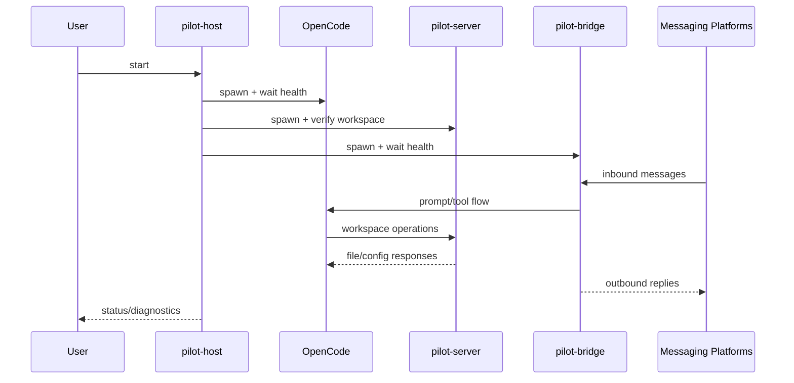

# Pilot Design Overview

This directory documents the runtime design of the Pilot suite:

- `host.md` (`pilot-host`): orchestrator and health aggregation
- `bridge.md` (`pilot-bridge`): multi-channel message bridge
- `dingtalk-setup.md`: DingTalk custom robot setup and troubleshooting for `pilot-bridge`
- `server.md` (`pilot-server`): workspace API + approval gateway
- `client-sunset-migration.md`: sunset decision and migration record for consolidating Pilot desktop runtime into `apps/client` (historical record only)

## Runtime Topology

## Design Goals

- Keep host/server/bridge responsibilities clearly separated.
- Make bridge channel expansion additive and observable.
- Keep approval and audit boundaries in server-side write paths.
- Keep operational diagnostics available via health/status endpoints.
