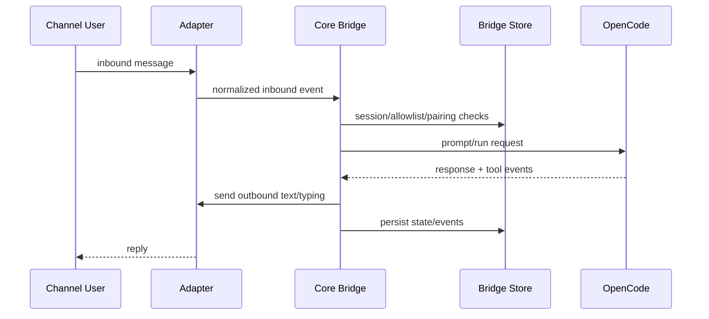

# Pilot Bridge Design (`apps/pilot/bridge`)

## Purpose

`pilot-bridge` translates chat messages between external channels and OpenCode sessions.

Current channel surface includes:

- whatsapp
- telegram
- slack
- feishu
- discord
- dingtalk
- email
- mochat
- qq

## Core Responsibilities

- Adapter lifecycle management (start/stop/send).
- Inbound normalization to a unified message model.
- Session mapping, access-identity resolution, allowlist checks, pairing policy, and command handling.
- Outbound send/typing updates back to channels.
- Health server output with channel status.

## Runtime Composition

- `BridgeRuntime` is the top-level lifecycle entry used by `startBridge(...)`.
- `BridgeCompositionFactory` owns top-level runtime graph assembly.
- `StoreBootstrap` owns store init + allowlist seed + pairing prune.
- `StreamRuntimeFactory` owns stream registries, typing/outbound setup, and event stream start wiring.
- `InboundRuntimeFactory` owns inbound service graph assembly and pipeline creation.
- `SessionFactory` owns session creation + announce/report semantics.
- `AdapterRuntimeManager` owns adapter initialize/start/stop/reload behavior (`reloadAdapter` strategy for telegram/slack), including registry materialization and reload flow.
- `BridgeHealthRuntime` owns health polling/timer lifecycle and health server wiring.
- `OpencodeHealthPoller` owns OpenCode health refresh state.
- `HealthConfigStore` owns config persistence for runtime mutations.
- `HealthHandlersFactory` owns groups/token mutation handlers exposed to health server.
- `HealthSnapshotBuilder` owns `HealthSnapshot` materialization from runtime state.
- `InboundPipeline` is orchestration-only and delegates to focused services:
  - `access-identity`: resolve per-channel `sessionKey` vs `accessKey`.
  - `AccessControlService`: channel access policy (`open`/`allowlist`/`pairing`/`disabled`) + self-chat policy.
  - `InboundCommandService`: slash command handling wrapper.
  - `TelegramInboundDeduper`: telegram duplicate inbound suppression.
  - `SessionBindingService`: resolve/create/rebind session-run bindings.
  - `RunExecutionService`: prompt execution, recovery, finalize and fallback.
- `OutboundDispatcher` centralizes text/file/progress send behavior with adapter capabilities.

## Source Layout

- `src/bridge/runtime/bridge.ts`, `src/bridge/runtime/bridge-runtime.ts`, `src/bridge/runtime/outbound-dispatcher.ts`:
  - stable runtime entrypoints and shared outbound sending utility.
- `src/bridge/runtime/composition/*`:
  - runtime graph assembly (`bridge-composition-factory`, `store-bootstrap`, `stream-runtime-factory`, `inbound-runtime-factory`, `session-factory`, `composition-types`).
- `src/bridge/runtime/adapters/*`:
  - adapter runtime lifecycle (`adapter-runtime-manager`).
- `src/bridge/runtime/health/*`:
  - health runtime lifecycle and health concerns (`bridge-health-runtime`, health poller/config/handlers/snapshot helpers).
- `src/bridge/inbound/*`:
  - inbound pipeline, access identity resolution, access control, session binding, prompt/run execution, command handling, OpenCode error normalization.
- `src/bridge/stream/*`:
  - event stream processor, stream coordinator abstractions, channel hooks, telegram stream/hook implementations, typing manager.
  - `event-router`: typed event handlers mapped by event type.
  - `tool-update-notifier`: tool-part dedupe + message formatting.
  - `session-idle-handler`: unified idle flow (`coordinator` + `hooks` + typing/reporting).
  - `telegram/*`: telegram streaming internals (`guards`, `role-index`, `stream-state-store`, `flush-engine`).
- `src/bridge/state/*`:
  - stateful registries and run/session model state helpers.
- `src/bridge/support/*`:
  - shared bridge constants and run reporting helpers.
- `src/adapters/common/*`:
  - transport-shared HTTP webhook infrastructure (`http-event-server`, `webhook-adapter-base`).
- `src/adapters/socket/*`:
  - socket-driven channels (`telegram`, `slack`, `discord`, `whatsapp/*`).
- `src/adapters/polling/*`:
  - polling-driven channels (`email`, `mochat`).
- `src/adapters/webhook/*`:
  - webhook-driven channels (`feishu`, `dingtalk`, `qq`).
- `src/bridge/index.ts`:
  - stable public export surface for bridge internals.

## Stream and Channel Extension Model

- Stream behavior is channel-pluggable through `StreamCoordinator` and `StreamCoordinatorRegistry`.
- `NoopStreamCoordinator` is the default safe fallback for channels without custom stream behavior.
- Channel-specific hooks are isolated behind `ChannelHooks` + `ChannelHooksRegistry`.
- `event-stream.ts` only performs event classification and coordinator/hook dispatch.
- Telegram-specific streaming/thinking behavior is isolated to:
  - `TelegramStreamCoordinator`
  - `TelegramChannelHooks`
- `TelegramStreamCoordinator` internally composes:
  - `TelegramRoleIndex` (message role cache)
  - `TelegramStreamStateStore` (part/delta state)
  - `TelegramFlushEngine` (serialized flush/finalize + scheduler)

This keeps non-telegram channels on a shared path while allowing opt-in specialization.

## Message Flow

## Adapter Architecture

- Adapter registration is centralized (name, label, enabled/configured predicates, creator).
- Bridge startup iterates registrations and starts enabled+configured adapters.
- Health `channels` map reflects adapter startup presence.
- Channel additions should be additive via registry + shared channel metadata.
- Adapter implementation style is complexity-driven:
  - high state/concurrency adapters use class implementations (`SlackAdapterImpl`, `DiscordAdapterImpl`, `WhatsAppAdapterImpl`, `EmailAdapterImpl`, `MochatAdapterImpl`).
  - lower-complexity adapters remain factory-function based (`Telegram`, `Feishu`, `DingTalk`, `QQ`).
- Public adapter creation APIs remain stable through `createXxxAdapter(...)` factories and `src/adapters/index.ts` exports.

## Configuration Model

- Runtime config is resolved from env + `bridge.json`.
- Access policy is per channel via `channels.<channel>.accessPolicy` or `ACCESS_POLICY_<CHANNEL>`.
- Access policy defaults are `pairing` for WhatsApp and `open` for other channels.
- Allowlist supports global and per-channel forms.
- Pairing is supported by channel capability; unsupported channels automatically fall back to allowlist behavior.
- Some channels support live token updates through bridge health-server config endpoints.
- DingTalk outbound webhook supports optional HMAC signing via `DINGTALK_SIGN_SECRET` / `channels.dingtalk.signSecret`.

## Operational Design

- Health endpoint: bridge and OpenCode health + per-channel started flags.
- CLI commands cover status/config/send/pairing operations.
- Logs/reporter output provide inbound/outbound visibility for debugging.
