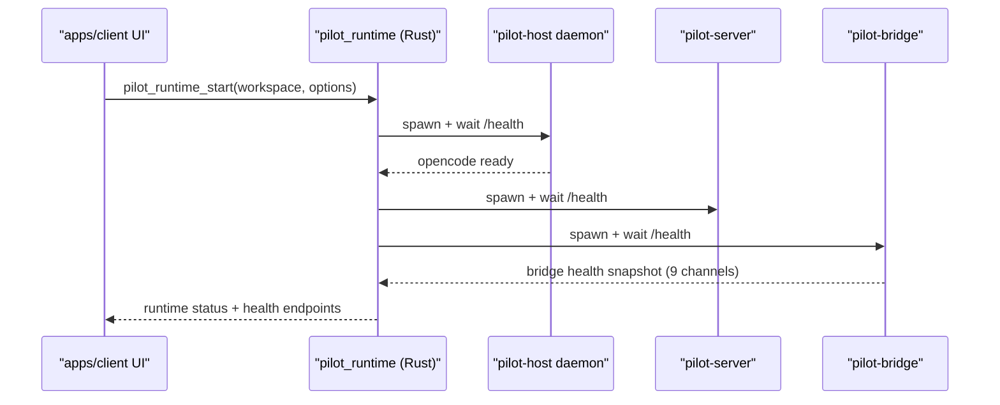
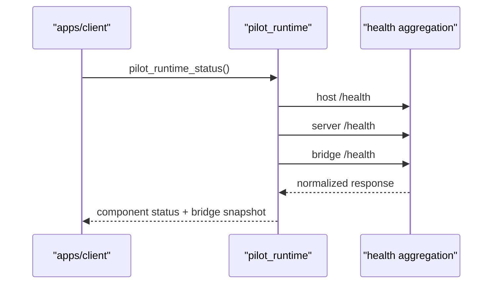

# Pilot Client Sunset and Consolidation Record

> Status: **HISTORICAL**.

## Summary

This document records the completed sunset of `apps/pilot/client` and consolidation of Pilot desktop runtime capability into `apps/client`.

Implemented scope:

- Core Pilot runtime orchestration moved to `apps/client` (host/server/bridge process control and health checks).
- `pilot-host`, `pilot-server`, and `pilot-bridge` remain standalone binaries/packages.
- `apps/pilot/client` removed from workspace membership and source tree.

Still out of scope:

- Porting legacy `apps/pilot/client` frontend pages into `apps/client`.
- Full migration of historical pilot-client command surface (skills/opkg/scheduler/workspace UI flows).

## Why Consolidate

- A single desktop app (`apps/client`) removes duplicated runtime concerns.
- Sidecar packaging and process orchestration now live in one desktop runtime.
- Operator and contributor documentation has a single cockpit entry.
- Pilot-facing UX can be introduced incrementally in `apps/client` without reviving a second desktop app.

## Runtime Architecture

## Completed Implementation

### Runtime backend in `apps/client`

- Added `apps/client/src-tauri/src/pilot_runtime/` module:
  - `manager.rs`
  - `host.rs`
  - `server.rs`
  - `bridge.rs`
  - `health_normalize.rs`
  - `mod.rs`
- Exposed runtime commands:
  - `pilot_runtime_start`
  - `pilot_runtime_stop`
  - `pilot_runtime_status`
  - `pilot_runtime_health`
- Added bridge health normalization with legacy compatibility:
  - accepts 9-channel payloads
  - accepts legacy 3-channel payloads and backfills missing channels as `false`

### Sidecar packaging in `apps/client`

- Extended `apps/client/src-tauri/build.rs` to provision:
  - `opencode`
  - `pilot-host`
  - `pilot-server`
  - `pilot-bridge`
- Updated `apps/client/src-tauri/tauri.conf.json` `bundle.externalBin`.
- Preserved env overrides:
  - `OPENCODE_BIN_PATH`
  - `PILOT_HOST_BIN_PATH`
  - `PILOT_SERVER_BIN_PATH`
  - `PILOT_BRIDGE_BIN_PATH`

### Thin TS runtime wrapper

- Added `apps/client/src/lib/pilot-runtime.ts` with strict invoke wrappers and exported runtime types.
- Added targeted tests for runtime wrapper behavior.

### Sunset completion

- Removed source tree: `apps/pilot/client`.
- Removed workspace/index references from root config files.
- Updated project and design docs to reflect the consolidated architecture.

## Runtime Status Flow

## Residual Phase 2 Backlog

- Evaluate which legacy pilot-client UI flows should be reintroduced in `apps/client`, and in what order.
- Keep `pilot-server` bridge control API expansion as a separate incremental track.
- Add user-facing `apps/client` UI entrypoints for Pilot runtime only when product scope is finalized.

## Verification Criteria

- `apps/client` runtime can start/stop/read health for host/server/bridge.
- `pilot_runtime_health` reports normalized bridge channel status with 9 keys.
- Legacy bridge health payloads do not break runtime parsing.
- `apps/pilot/client` remains absent from workspace and source tree.
