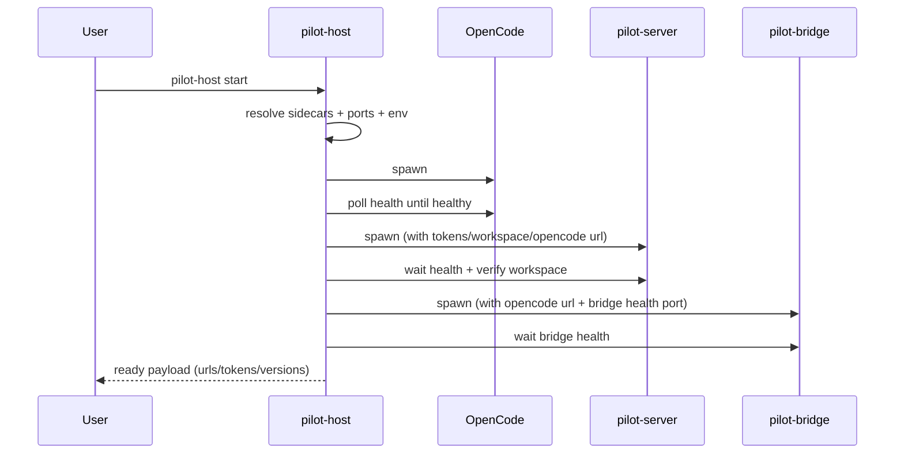

# Pilot Host Design (`apps/pilot/host`)

## Purpose

`pilot-host` is the process orchestrator for Pilot runtime. It starts and supervises:

- OpenCode sidecar
- pilot-server sidecar
- pilot-bridge sidecar

It is responsible for lifecycle ordering, health readiness checks, and operator-facing status output.

## Core Responsibilities

- Resolve sidecar binaries (bundled/downloaded/external).
- Start services in dependency order.
- Wait for health and verify compatibility (versions/workspace binding).
- Verify OpenCode connectivity and workspace/OpenCode contract via pilot-server `/workspaces` payload.
- Default startup stays single-workspace and passes workspace/opencode settings directly.
- Expose operator diagnostics (`start` output, `status` command).
- Handle shutdown and restart-related failure policy (`bridge-required`).

## Start Flow

## Status Flow

`pilot-host status` checks:

- Pilot server health (`--pilot-url`)
- OpenCode health (`--opencode-url`)
- Bridge health (`--bridge-url` or fallback `127.0.0.1:${BRIDGE_HEALTH_PORT|3005}`)

Bridge health supports normalized 9-channel output and legacy compatibility.

## Failure Handling

- If OpenCode or pilot-server fails startup readiness, host exits with failure.
- Bridge is optional by default; host can continue without it unless `--bridge-required` is enabled.
- Periodic bridge health polling is best-effort for observability.

## Boundaries

- Host does not own channel-level bridge configuration semantics.
- Host does not replace approval/audit controls from pilot-server.
- Host focuses on process supervision and operator diagnostics.
