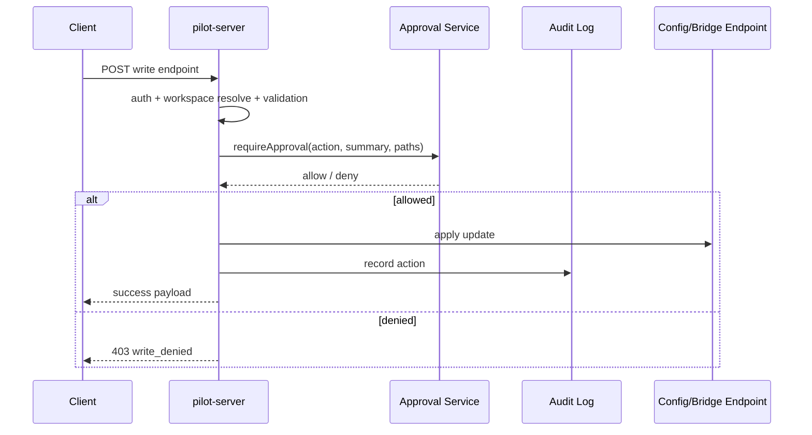

# Pilot Server Design (`apps/pilot/server`)

## Purpose

`pilot-server` provides filesystem-oriented control APIs for Pilot clients and serves as the approval/audit boundary for write operations.

## Core Responsibilities

- Workspace-scoped APIs (config/plugins/skills/mcp/commands/events).
- Approval gating for writes.
- Audit recording for mutable operations.
- Runtime schema validation for request payloads.
- Capability and health/status reporting.
- Bridge-related control endpoints (currently Telegram/Slack token routes).

## Request and Approval Flow

## Bridge Integration Model

- Bridge routes are server-side proxies/controls rather than channel runtime handlers.
- Current write routes target bridge config operations for:
  - Telegram token
  - Slack bot/app tokens
- Bridge route updates still follow the same approval and audit policy as other writes.

## Health and Status Model

- `/health`: liveness + version + uptime.
- `/status` and workspace-scoped variants: runtime flags, active workspace, server diagnostics.
- `/capabilities`: read/write surface advertised to clients.
- Workspace model is `single-active`.
- `/workspaces` returns all authorized workspaces, ordered with active workspace first.

Workspace-scoped variants support both `/workspace/:id/*` and `/w/:id/*` where applicable.

## Scheduler Surface

- Scheduler is treated as a global OpenCode resource.
- Endpoints:
  - `GET /scheduler/jobs`
  - `DELETE /scheduler/jobs/:slug`
  - Deletion is a global write flow and does not depend on an active workspace.

## Validation and safety model

- Request payloads are validated at runtime before route logic.
- Workspace config is validated by `workspaceType`; `remote` requires `baseUrl` + `directory`.
- Workspace ids are optional in config and must be unique after resolution.
- Write routes share a single execution flow: writable check, workspace resolve, approval, mutate, audit, reload event.
- If mutate succeeds but audit/reload fails, server returns `write_partially_applied` with details (`stage`, `mutated=true`, `workspaceId`).
- Request bodies are capped by `PILOT_MAX_BODY_BYTES` (default 1MB).
- Bridge health config updates are loopback-only (`127.0.0.1` / `::1`).
- Workspace/status payloads include workspace-level OpenCode endpoint/auth fields for host compatibility checks.

## Boundaries

- Server does not run adapters directly.
- Server does not replace host process orchestration.
- Server remains focused on API policy, workspace operations, and controlled mutation flows.
